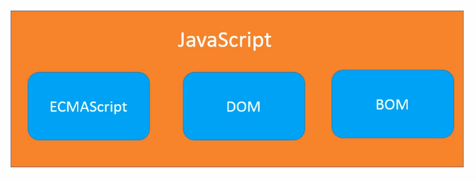

# JavaScript

[JavaScript reference](https://developer.mozilla.org/en-US/docs/Web/JavaScript/Reference)

## JavaScript 和 ECMAScript的关系]

ECMAScript是JavaScript的标准, 表述了JavaScript的语法和基本对象.

JavaScript是ECMAScript的一种实现, 除了基本实现之外, 还包括DOM操作和BOM操作.



## JavaScript的编写位置

```html
<!DOCTYPE html>
<html lang="en">

<head>
    <meta charset="UTF-8">
    <meta name="viewport" content="width=device-width, initial-scale=1.0">
    <title>Document</title>
</head>

<body>
    <!-- 1. 在HTML元素属性中写入JavaScript代码(不推荐)  -->
    <a href="" onclick="alert('我是弹窗')">链接1</a>
    <a href="javascript:alert('我也是弹窗')">链接2</a>
    <!-- 2. 在script元素内容中写入Javascript代码(学习阶段) -->
    <script>
        alert("我是直接弹窗");
    </script>
    <!-- 3. 从外部引入JavaScript文件(开发阶段) -->
    <script src="test.js"></script>
</body>

</html>
```
说明:

1. `<script>`标签的`type`属性默认是`text/javascript`, 因此不用指定该属性, 这一点和`<style>`标签的`type`默认属性是`text/css`一样.
2. 作为HTML文档的一部分, JavaScript默认遵循HTML文档的加载顺序, 即自上而下的加载顺序, 推荐将JavaScript代码和编写位置放在`body`子元素的左后一行

## 浏览器交互

```javascript
// 弹窗输出
alert("hello world");
// 控制台打印
console.log("hello world");
// DOM操作HTML输出
document.write("hello world");
// 弹窗输入
var age = prompt("how old are you?");
```

## 变量的定义

```javascript
// 变量初始化
var x = "a";
// 变量赋值
x = "b";

// 变量声明
var y;
// 变量赋值
y = 3;

// 多变量声明
var i, j, k;

// 多变量初始化
var a = 1, b = 2, c= 3;
```

## 关键字和保留字

[关键字和保留字](https://developer.mozilla.org/en-US/docs/Web/JavaScript/Reference/Lexical_grammar#Keywords)

## 数据类型

[数据类型和数据结构](https://developer.mozilla.org/en-US/docs/Web/JavaScript/Data_structures)

[Primitive](https://developer.mozilla.org/en-US/docs/Glossary/Primitive)

基本类型

- `undefined`
- `boolean`
- `number`
- `string`
- `bigint`
- `symbol`
- `null`

引用类型

- `object`
- `function`

[Javascript中字符串直接量与new String的区别](http://xiaoyuze88.github.io/blog/2015/05/29/Javascript%E4%B8%AD%E5%AD%97%E7%AC%A6%E4%B8%B2%E7%9B%B4%E6%8E%A5%E9%87%8F%E4%B8%8Enew-String%E7%9A%84%E5%8C%BA%E5%88%AB)

使用 `typeof` 操作符获取变量类型, `typeof` 语法如下:

```javascript
typeof operand
typeof(operand)
```

[为什么JavaScript里面typeof(null)的值是"object"？](https://www.zhihu.com/question/21691758)

**基本数据类型**保存在栈内存中, 因为基本数据类型占用空间小, 大小固定, 通过按值来访问, 属于被频繁使用的数据.

**引用数据类型**存储在堆内存中,因为引用数据类型占据空间大, 大小不固定. 如果存储在栈中, 将会影响程序运行的性能; 引用数据类型在栈中存储了指针, 该指针指向堆中该实体的起始地址. 当解释器寻找引用值时, 会首先检索其在栈中的地址, 取得地址后从堆中获得实体.

## 表达式和操作符

[Expressions and operators](https://developer.mozilla.org/en-US/docs/Web/JavaScript/Reference/Operators)

### `==` 与 `===` 操作符

[Equality (==)](https://developer.mozilla.org/en-US/docs/Web/JavaScript/Reference/Operators/Equality)

[Strict equality (===)](https://developer.mozilla.org/en-US/docs/Web/JavaScript/Reference/Operators/Strict_equality)

`==`和`===`操作符都是检查其两个操作数是否相等, 并返回Boolean结果.

`==` 运算符的两个操作数如果不是同一类型的话, 它会尝试强制类型转换并且比较不同类型的操作数.

`===` 全等运算符与 `==` 相等运算符不同, 全等运算符总是认为不同类型的操作数是不同的.

### `&&` 与 `||` 操作符

下列表达式会被转换为`false`

- `null`
- `NaN`
- `0`
- 空字符串 (`""`, `''`, `\`\``)
- `undefined`

[Logical AND (&&)](https://developer.mozilla.org/en-US/docs/Web/JavaScript/Reference/Operators/Logical_AND)

```javascript
expr1 && expr2
```

If `expr1` can be converted to `true`, returns `expr2`; else, returns `expr1`.

[Logical OR (||)](https://developer.mozilla.org/en-US/docs/Web/JavaScript/Reference/Operators/Logical_OR)

``` javascript
expr1 || expr2
```
If `expr1` can be converted to `true`, returns `expr1`; else, returns `expr2`.

## 索引集合类 (Indexed collections)

[Indexed collections](https://developer.mozilla.org/en-US/docs/Web/JavaScript/Guide/Indexed_collections)

### 数组(Array)

[数组(Array)](https://developer.mozilla.org/en-US/docs/Web/JavaScript/Reference/Global_Objects/Array)

数组的创建

[Array() constructor](https://developer.mozilla.org/en-US/docs/Web/JavaScript/Reference/Global_Objects/Array/Array)

```javascript
[element0, element1, ..., elementN]
new Array(element0, element1[, ...[, elementN]])
new Array(arrayLength)
```

使用一个合法的下标为数组元素赋值，并且该下标超出了当前数组的大小的时候，解释器会同时修改 `length` 的值：

```javascript
var fruits = [];
fruits[5] = 'mango';
console.log(fruits[5]); // 'mango'
console.log(Object.keys(fruits));  // ["5"]
console.log(fruits.length); // 6
```

### 类型数组

[类型数组(TypedArray)](https://developer.mozilla.org/zh-CN/docs/Web/JavaScript/Reference/Global_Objects/TypedArray)

## 函数(Function)

[Functions](https://developer.mozilla.org/en-US/docs/Web/JavaScript/Reference/Functions)

### 函数定义

1. 函数声明(`function`语句)

```javascript
function name([param[, param[, ... param]]]) {
   statements
}
```

2. 函数表达式

```javascript
function [name]([param[, param[, ... param]]]) {
   statements
}
```

3. 函数生成器声明(`function*` 语句)

```javascript
function* name([param[, param[, ...param]]]) { statements }
```

4. 函数生成器表达式

```javascript
function* [name]([param] [, param] [..., param]) { statements }
```

5. 箭头函数表达式 (`=>`)

```javascript
([param] [, param]) => { statements } param => expression
```

6. `Function` 构造函数**(不推荐)**

```javascript
new Function (arg1, arg2, ... argN, functionBody)
```

7. `GeneratorFunction` 构造函数**(不推荐)**

```javascript
new GeneratorFunction (arg1, arg2, ... argN, functionBody)
```

[构造器, 声明和表达式之间的差别](https://developer.mozilla.org/en-US/docs/Web/JavaScript/Reference/Functions#Constructor_vs._declaration_vs._expression)

### 函数参数

[函数参数](https://developer.mozilla.org/en-US/docs/Web/JavaScript/Reference/Functions#Function_parameters)

- 默认参数
- 剩余参数
- `arguments`对象

## 对象

[Object](https://developer.mozilla.org/en-US/docs/Web/JavaScript/Reference/Global_Objects/Object)

### 对象的创建

- [`Object()` 构造器](https://developer.mozilla.org/en-US/docs/Web/JavaScript/Reference/Global_Objects/Object/Object)
- [字面量](https://developer.mozilla.org/en-US/docs/Web/JavaScript/Reference/Operators/Object_initializer)

## 原型链与继承

[几句话整理下Javascript原型链与继承](http://xiaoyuze88.github.io/blog/2015/05/15/%E5%87%A0%E5%8F%A5%E8%AF%9D%E6%95%B4%E7%90%86%E4%B8%8BJavascript%E5%8E%9F%E5%9E%8B%E9%93%BE%E4%B8%8E%E7%BB%A7%E6%89%BF)