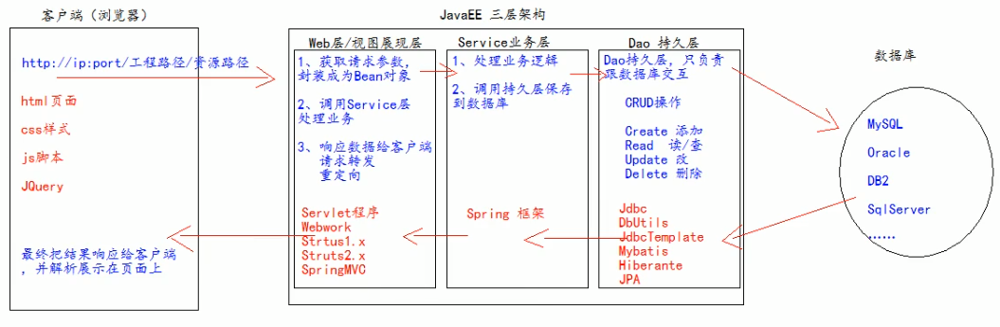
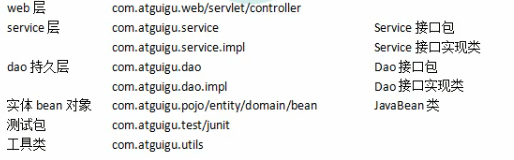

# JavaEE 三层结构

参考：

[MVC 与三层架构](https://juejin.cn/post/6844903479568252935)

[MVC设计模式](https://zhuanlan.zhihu.com/p/68424497)

## 三层架构

1. 界面层：和用户打交道，接受用户的请求参数，调用业务逻辑层处理请求业务，显示请求的处理结果。（JSP，HTML，Servlet）。
2. 业务逻辑层：接受了界面层传递的数据，检查数据，计算业务逻辑，调用数据访问层对数据库进行操作。
3. 数据访问层：与数据库打交道，主要实现对数据的增、删、改、查。

## 三层对应的包及类

- 界面层：controller包（Servlet类）
- 业务逻辑层：service包（XXXService类）
- 数据访问层：dao包（XXXDao类）

## 三层的交互关系

界面层 --> 业务逻辑层 --> 数据访问层 --> 数据库（mysql）

## 框架定义

[软件框架](https://zh.wikipedia.org/wiki/%E8%BB%9F%E9%AB%94%E6%A1%86%E6%9E%B6)

框架（Framework）是整个或部分系统的可重用设计，表现为一组抽象构件及构件实例间交互的方法；另一种认为，框架式被应用开发者定制的应用骨架、模板。

简而言之，框架就是制定一套规范或者规则（思想），大家（程序员）在该规范或者规则（思想）下工作。或者说使用别人搭好的舞台来做编剧和表演。

## 三层框架

界面层：Servlet --> Spring MVC
业务逻辑层：XXXService --> Spring
数据访问层：XXXDao --> MyBatis