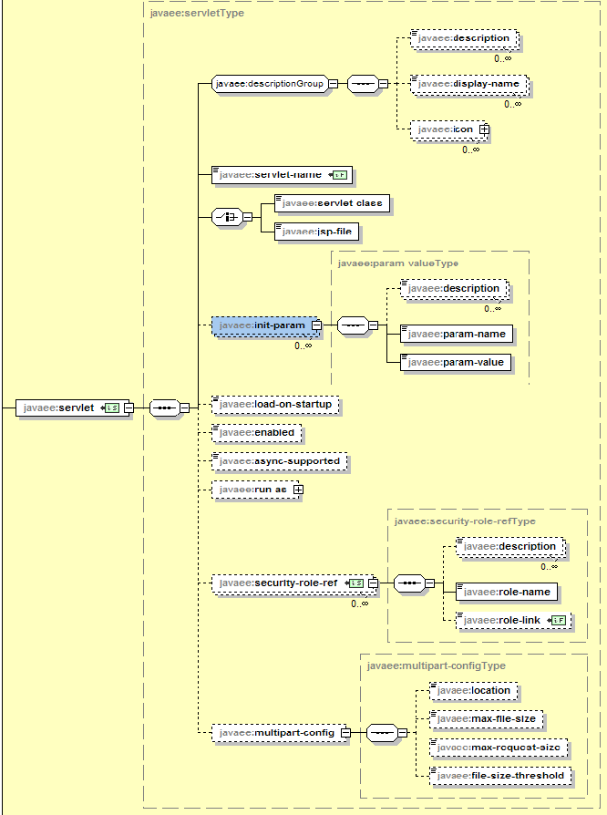

# Servlet

Servlet 是JavaEE规范中`javax.servlet.Servlet`接口；是JavaWeb三大组件之一（Servlet，Filter，Listener）；运行在服务器上的一个小程序它可以接收客户端发送过来的请求，并响应数据给客户端。

```java
public interface Servlet {
    public void init(ServletConfig config) throws ServletException;

    public ServletConfig getServletConfig();

    public void service(ServletRequest req, ServletResponse res)
	throws ServletException, IOException;

    public String getServletInfo();

    public void destroy();
}
```
## Servlet 生命周期

1. 执行 Servlet 构造器方法（第一次访问的时候被调用）
2. 执行 init 初始化方法（第一次访问的时候被调用）
3. 执行 service 服务方法（每次访问都会调用）
4. 执行 destroy 销毁方法（web工程停止的时候调用）

## Servlet 的实现

实现`Servlet`接口可以编写扩展`javax.servlet.GenericServlet`的通用servlet或扩展`javax.servlet.http.HttpServlet`的HTTP servlet。

## Servlet 元素结构

参考：[Servlet 4.0 164页](https://download.oracle.com/otn-pub/jcp/servlet-4-final-eval-spec/servlet-4_0_FINAL.pdf)




元素 `load-onstartup` 表示应该在 Web 应用程序启动时加载(实例化并调用它的init())这个 Servlet。该元素的元素内容必须是一个整数，指示 Servlet 应该以何种顺序加载。如果值是一个负整数，或者元素不存在，容器可以随时加载 Servlet。如果该值为正整数或0，则容器必须在部署应用程序时加载并初始化 Servlet。容器必须保证标记为小整数的 Servlet 在标记为大整数的 Servlet 之前加载。容器可以选择以相同的启动时加载值加载 Servlet的顺序。

## Servlet 继承体系

`interface Servlet` <---implements---- `abstract class GenericServlet` <---extends---- `abstract class HttpServlet` <---extends---- `class MyServlet`

## SerlvetConfig 接口

```java
public interface ServletConfig {
    // 获取Servelet实例名
    public String getServletName();
    // 获取ServletContext对象
    public ServletContext getServletContext();
    // 获取Servlet初始化参数
    // 在 web.xml servlet 元素中创建的 init-param 元素
    public String getInitParameter(String name);
    public Enumeration<String> getInitParameterNames();
}
```

- Servlet程序和ServletConfig对象都是由Tomcat负责（反射）创建；Servlet程序默认是第一次访问的时候创建
- ServletConfig是每个Servlet创建时，就创建一个对应的ServletConfig对象，即一个Servlet对应一个web工程中的`<servlet>`元素
- ServletConfig对象将作为`init`方法的参数用来实现对Servlet对象的初始化
- 重写`GenericServlet`的`init`方法要调用`super.init`，并将`ServletConfig`作为其参数，否则`getServletConfig`为`null`

## ServletContext 接口

ServletContext 接口表示 Servlet的上下文对象；一个ServletConfig对象仅仅对应一个Servlet对象，而一个Web工程中的所有Servlet对象共用一个ServletContext对象实例；ServletContext对象类似于一个Map对象，可以用于设置（setAttribute）/获取（getAttribute）、删除（removeAttribute）`web.xml`文件中`<context-param>`中的上下文参数（属于整个web工程）。

ServletContext 的作用

1. `getInitParameter`：获取`web.xml`中`<context-param>`元素的配置的上下文参数
2. `getContextPath()`：获取当前工程路径
3. `getResourceAsStream(String)`：以当前工程路径为根目录获取文件输入流
4. `getRealPath(String)`：获取与url路径对应的web项目的真实路径
5. `setAttribute/getAttribute`可以像Map一样存储数据

注：ServletContext接口可以被web工程里的所有Servlet访问到；ServletConfig对象只能被web工程里的对应Servlet访问；web工程重启，之前通过`setAttribute`存储的数据会被清空。

## HTTP

### [HTTP消息](https://developer.mozilla.org/zh-CN/docs/Web/HTTP/Messages)

### [消息头](https://developer.mozilla.org/en-US/docs/Web/HTTP/Headers)：

- `User-Agent`：标识发送请求的浏览器
- `Accept`：列出用户代理希望接收的媒体资源的 MIME 类型
- `Accept-Language`：列出用户代理期望的页面语言
- `Host`：请求将要发送到的服务器主机名和端口号
- `Referer`：当前请求页面的来源页面的地址
- `Connection`：决定当前的事务完成后，是否会关闭网络连接
    - `keep-alive`：表明客户端想要保持该网络连接打开，HTTP/1.1的请求默认使用一个持久连接，使得对同一个服务器的请求可以继续在该连接上完成
    - `close`：表明客户端或服务器想要关闭该网络连接，这是HTTP/1.0请求的默认值
- `Content-Type`：指示资源的MIME类型，字符编码`charset`和边界`boundary`
- `Server`：处理请求的源头服务器所用到的软件相关信息

常见`Content-Type`

1. `application/x-www-form-urlencoded`：发送URL编码的参数

```
Content-Type: application/x-www-form-urlencoded
username=admin&passowrd=admin
```

2. `multipart/form-data`：可以发送文件

```
Content-Type: multipart/form-data;boundary=------FormBoundaryShouldDifferAtRuntime
Host: localhost:8080
------FormBoundaryShouldDifferAtRuntime
Content-Disposition: form-data; name="username"

admin
------FormBoundaryShouldDifferAtRuntime
Content-Disposition: form-data; name="passowrd"

admin
------FormBoundaryShouldDifferAtRuntime--
```

### [HTTP响应码](https://developer.mozilla.org/zh-CN/docs/Web/HTTP/Status)

- `200 OK`：请求成功.
- `302 Found`：请求的资源现在临时从不同的 URI 响应请求。由于这样的重定向是临时的，客户端应当继续向原有地址发送以后的请求。
- `404 Not Found`：请求失败，请求所希望得到的资源未被在服务器上发现。
- `500 Internal Server Error`：服务器遇到了不知道如何处理的情况。

### [MIME types](https://developer.mozilla.org/en-US/docs/Web/HTTP/Basics_of_HTTP/MIME_types)

## HttpServletRequest

- HTTP使用的是TCP连接，每次请求时都会从从连接中获取HTTP请求，使用 `HttpServletRequest` 对请求信息进行封装
- `HttpServletRequest` 作为 `HttpServlet.service` 参数传入服务函数中为 `HttpServlet对象` 服务提供HTTP请求信息

[HttpServletRequest API](https://docs.oracle.com/javaee/7/api/javax/servlet/http/HttpServletRequest.html)

- `HttpServletRequest | String getRequestURI()`：返回这个请求的URL从协议名到HTTP请求第一行的查询字符串的部分，即请求资源。
- `HttpServletRequest | StringBuffer getRequestURL()`：重构客户端用于发出请求的URL。返回的URL包含协议，服务器名称，端口号和服务器路径，但不包含查询字符串参数。
- `ServletRequest | String getRemoteHost()`：返回发送请求的客户端或最后一个代理的完全限定名称。如果引擎不能或选择不解析主机名（以提高性能），本方法返回IP地址的点串形式。
- `HttpServletRequest | String get(String name)`：以字符串形式返回指定请求头的值。 如果请求不包含指定名称的请求头，则此方法返回null。 如果存在多个具有相同名称的请求头，则此方法返回请求中的第一个请求头。请求头名称不区分大小写。
- `HttpServletRequest | String getMethod()`：返回发出此请求的HTTP方法的名称，例如GET，POST或PUT。
- `ServletRequest | String getParameter(String name)`：以字符串形式返回请求参数的值，如果参数不存在，则返回null。请求参数是与请求一起发送的额外信息。对于HTTP Servlet，参数包含在查询字符串或发布的表单数据中。
- `ServletRequest | void setCharacterEncoding(String env) throws UnsupportedEncodingException`：覆盖此请求正文中使用的字符编码的名称。 在读取请求参数或使用getReader（）读取输入之前，必须先调用此方法。 否则，它无效。
- `ServletRequest | getAttribute/setAttribute/removeAttribute`：获取、设置、删除请求属性，该属性仅在一次请求中有效；虽然`RequestDispatcher`调度中的请求和调用`RequestDispatcher`的Servlet中的请求不一样，但是它们请求属性是一样。

## [RequestDispatcher](https://docs.oracle.com/javaee/7/api/javax/servlet/RequestDispatcher.html)

[Servlet Container](https://dzone.com/articles/what-servlet-container)：Servlet容器负责Servlet的创建，执行和销毁。

定义一个对象，该对象从客户端接收请求并将请求发送到服务器上的任何资源（例如servlet，HTML文件或JSP文件）。 Servlet容器创建RequestDispatcher对象，该对象用作位于特定路径或由特定名称指定的服务器资源的包装。

### 创建方法

|方法|描述|
|---|----|
|`ServletContext.getRequestDispatcher(String path)`|包装给定路径的资源；资源可以是静态也可以是动态的；路径必须以”/"开头以表示当前上下文根目录（Web工程目录）；使用`ServletContext.getContext`获取外部上下文中资源的RequestDispatcher。|
|`ServletContext.getNamedDispatcher(String name)`|包装给定名称的Servlet；可以通过服务器管理或通过Web应用程序部署描述符为Servlet（以及JSP页面）命名；通过`ServletConfig.getServletName()`获取Servlet的名称|
|`ServletRequest.getRequestDispatcher(String path)`|包装给定路径的资源；资源可以是静态也可以是动态的；路径可以是相对路径（相对于请求路径）；如果路径以”/"开头以表示当前上下文根目录（Web工程目录）|

注：

1. 一个Web工程公用一个`ServletContext`，`ServletContext`的上下文根目录就是`web.xml`中`<url-pattern>`元素的值。
2. `ServletContext.getContext`是切换到其他Web工程的`ServletContext`上下文。

### 接口方法

**void forward(ServletRequest request, ServletResponse response) throws ServletException, IOException**

将请求从servlet转发到服务器上的另一个资源（servlet，JSP文件或HTML文件）。此方法允许一个Servlet对请求进行初步处理，而另一种资源则可以生成响应。

对于通过`getRequestDispatcher()`获得的`RequestDispatcher`，`ServletRequest`对象的路径元素和参数已调整为与目标资源的路径匹配。如果servletA调度servletB，`forward`中的`ServletRequest`是servletB的路径，`ServletRequest`的其他参数基本一致。

*在将响应提交给客户端之前（在刷新响应主体输出之前），应调用`forward`。 如果响应已经提交，则此方法引发`IllegalStateException`。 在转发之前，将自动清除响应缓冲区中未提交的输出。*

请求和响应参数必须与传递给调用servlet的服务方法的对象相同，或者是包装它们的`ServletRequestWrapper`或`ServletResponseWrapper`类的子类。

**void include(ServletRequest request, ServletResponse response) throws ServletException, IOException**

在响应中包括资源的内容（servlet，JSP页面，HTML文件）。本质上，此方法启用程序化服务器端包含。

`ServletResponse`对象的路径元素和参数与调用方的参数保持不变。*包含的servlet不能更改响应状态代码或设置标头。任何进行更改的尝试都将被忽略。*

请求和响应参数必须与传递给调用servlet的服务方法的对象相同，或者是包装它们的`ServletRequestWrapper`或`ServletResponseWrapper`类的子类。

注：由于RequestDispatcher调度时请求url并不改变，因此使用相对路径可能会存在问题；因此使用[<base>](https://developer.mozilla.org/zh-CN/docs/Web/HTML/Element/base)标签来指定根URL。

## ServletResponse

字节流：`ServletOutputStream getOutputStream() throws IOException`
字符流：`PrintWriter getWriter() throws IOException`

注：

1. 在`ServletOutputStream`和`PrintWriter`调用`flush`方法可以将内容提交到响应
2. `PrintWriter`使用`getCharacterEncoding()`返回的字符编码。默认是`ISO-8859-1`
3. `getWriter`和`getOutputStream`不能同时调用，除非调用[`reset()`](https://docs.oracle.com/javaee/7/api/javax/servlet/ServletResponse.html#reset--)方法
4. 通过`void setCharacterEncoding(String charset)`设置字符流编码，如果在调用`getWriter`之后或在提交响应之后调用此方法，则该方法无效。

## 请求重定向

[HTTP 的重定向](https://developer.mozilla.org/zh-CN/docs/Web/HTTP/Redirections)

```java
public class Redirection extends HttpServlet {
    private static final long serialVersionUID = -2057551505456598143L;

    @Override
    protected void doGet(HttpServletRequest req, HttpServletResponse resp) throws ServletException, IOException {
        // resp.setStatus(302);
        // resp.setHeader("Location", "http://localhost:8080/webapp/servletB");
        resp.sendRedirect("http://localhost:8080/webapp/servletB");
    }
}
```

注：

1. 地址栏会发生变化
2. 重定向是两次请求，请求的参数在两次请求中不能共享


## 字符编码

HTML 中的`<meta charset="utf-8">`元素用于设置文档使用utf-8字符集编码，utf-8字符集包含了人类大部分的文字。

```java
protected void servletInit(HttpServletRequest req, HttpServletResponse resp) throws UnsupportedEncodingException {
    req.setCharacterEncoding("UTF-8");
    resp.setCharacterEncoding("UTF-8");
    resp.setContentType("text/plain");
}
```

Servlet 中的代码`resp.setCharacterEncoding("UTF-8");`与`resp.setContentType("text/plain");`等价于响应中的`Content-Type: text/plain;charset=UTF-8`
