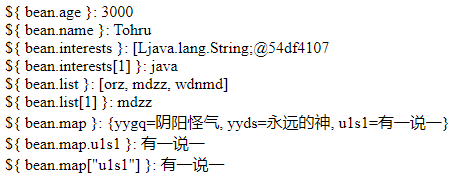

# EL(Expression Language)

EL表达式主要是代替JSP页面中的表达式脚本在JSP页面中进行数据的输出。因为EL表达式在输出数据的时候比JSP的表达式脚本要简洁很多。

[The Java EE Tutorial Release 7](https://docs.oracle.com/javaee/7/JEETT.pdf)

```jsp
<html>
<body>
    <%
        request.setAttribute("key", "value");
    %>
    <h2>&lt;% request.setAttribute("key", "value"); %&gt;</h2>
    <br/>
    <h2>JSP 脚本 &lt;%= request.getAttribute("key") %&gt;: <%= request.getAttribute("key") %></h2>
    <h2>EL表达式 &dollar;{ key }: ${ key } </h2>
    <br/>
    <h2>JSP 脚本 &lt;%= request.getAttribute("key1") %&gt;: <%= request.getAttribute("key1") %></h2>
    <h2>EL表达式 &dollar;{ key }: ${ key1 } </h2>
</body>
</html>
```

翻译后的Java代码如下

```java
out.write("    <h2>JSP 脚本 &lt;%= request.getAttribute(\"key\") %&gt;: ");
out.print( request.getAttribute("key") );
out.write("</h2>\n");
out.write("    <h2>EL表达式 &dollar;{ key }: ");
out.write((java.lang.String) org.apache.jasper.runtime.PageContextImpl.proprietaryEvaluate("${ key }", java.lang.String.class, (javax.servlet.jsp.PageContext)_jspx_page_context, null));
out.write(" </h2>\n");
out.write("    <br/>\n");
out.write("    <h2>JSP 脚本 &lt;%= request.getAttribute(\"key1\") %&gt;: ");
out.print( request.getAttribute("key1") );
out.write("</h2>\n");
out.write("    <h2>EL表达式 &dollar;{ key1 }: ");
out.write((java.lang.String) org.apache.jasper.runtime.PageContextImpl.proprietaryEvaluate("${ key1 }", java.lang.String.class, (javax.servlet.jsp.PageContext)_jspx_page_context, null));
```

如果发现EL表达式无效，参考[JSP页面不支持EL表达式的解决方法](https://www.cnblogs.com/EasonJim/p/6959120.html)。

`PageContextImpl.proprietaryEvaluate` 方法没看懂，但是EL表达式的结果如果是`null`的话，输出的是空串；而脚本标签的中的`request.getAttribute`如果返回的字符串是`null`，输出的内容就是`null`。

## EL 表达式搜索

EL表达式从`pageContext`,`request`,`session`和`application`四个域对象中搜索数据。

搜索顺序是按作用范围从小到大的顺序搜索的，即先搜索`pageContext`,再搜索再搜索`request`,再搜索`session`，最后搜索`application`。

## EL 表达式输出Bean属性

```java
package xyz.zerxoi;

import java.util.Arrays;
import java.util.HashMap;
import java.util.List;
import java.util.Map;

public class JavaBean {
    private int age;
    private String name;
    private String[] interests;
    private Map<String, String> map;
    private List<String> list;

    public JavaBean() {

        map = new HashMap<>();
    }

    public JavaBean(int age, String[] interests, Map<String, String> map, List<String> list) {
        this.age = age;
        this.interests = interests;
        this.map = map;
        this.list = list;
    }

    public int getAge() {
        return age;
    }

    public void setAge(int age) {
        this.age = age;
    }

    public String[] getInterests() {
        return interests;
    }

    public void setInterests(String[] interests) {
        this.interests = interests;
    }

    public Map<String, String> getMap() {
        return map;
    }

    public void setMap(Map<String, String> map) {
        this.map = map;
    }

    public List<String> getList() {
        return list;
    }

    public void setList(List<String> list) {
        this.list = list;
    }

    public String getName() {
        return name;
    }

    public void setName(String name) {
        this.name = name;
    }

    @Override
    public String toString() {
        return "JavaBean [age=" + age + ", interests=" + Arrays.toString(interests) + ", list=" + list + ", map=" + map
                + "]";
    }
}
```

```jsp
<%@ page contentType="text/html; charset=UTF-8" isELIgnored="false" %>
<%@ page import="xyz.zerxoi.JavaBean, java.util.*" %>
<html>

<body>
    <%
        JavaBean bean = new JavaBean();
        pageContext.setAttribute("bean", bean);
        bean.setName("Tohru");
        bean.setAge(3000);
        String[] interests = new String[] {"cpp", "java", "golang"};
        bean.setInterests(interests);
        List<String> list = new ArrayList<>();
        list.add("orz");
        list.add("mdzz");
        list.add("wdnmd");
        bean.setList(list);
        Map<String, String> map = new HashMap<>();
        map.put("u1s1", "有一说一");
        map.put("yyds", "永远的神");
        map.put("yygq", "阴阳怪气");
        bean.setMap(map);
    %>
    &dollar;{ bean.age }: ${ bean.age } <br />
    &dollar;{ bean.name }: ${ bean.name } <br />
    &dollar;{ bean.interests }: ${ bean.interests } <br />
    &dollar;{ bean.interests[1] }: ${ bean.interests[1] } <br />
    &dollar;{ bean.list }: ${ bean.list } <br />
    &dollar;{ bean.list[1] }: ${ bean.list[1] } <br />
    &dollar;{ bean.map }: ${ bean.map } <br />
    &dollar;{ bean.map.u1s1 }: ${ bean.map.u1s1 } <br />
    &dollar;{ bean.map["u1s1"] }: ${ bean.map["u1s1"] } <br />
</body>

</html>
```



注：

1. EL表达式中的`bean`是根据域对象`pageContext`中JavaBean对象应对应的键，如果改为`pageContext.setAttribute("b", bean);`，则EL表达式中的`bean`应该变为`b`
2. EL表达式中的`age`，`name`，`list`和`map`并不是对象的属性，其实其对应的`getter`和`setter`方法

如果在javaBean中加入一个新的方法
```java
public class JavaBean {
    // ...
    public int getX() {
        return 2077; 
    }
    // ...
}
```

在EL表达式可以通过 `${ bean.x }` 获取到返回的结果`2077`并输出。

3. `map`对象可以通过`map[xx]`或者`map.xx`获取`xx`键对应的值。

## EL表达式 empty运算

```jsp
    <%
    // 1. 值为 null
    pageContext.setAttribute("emptyNull", null);
    // 2. 空串
    pageContext.setAttribute("emptyStr", "");
    // 3. 空数组
    pageContext.setAttribute("emptyArray1", new Object[]{});
    pageContext.setAttribute("emptyArray2", new Object[3]);
    pageContext.setAttribute("emptyArray3", new Integer[]{});
    pageContext.setAttribute("emptyArray4", new int[]{});
    pageContext.setAttribute("emptyArray5", new int[3]);
    // 4. 空List
    pageContext.setAttribute("emptyList", new ArrayList<String>());
    // 5. 空Map
    pageContext.setAttribute("emptyMap", new HashMap<String, String>());
    %>

    ${empty emptyNull } <%-- true --%>
    ${empty emptyStr } <%-- true --%>
    ${empty emptyArray1 } <%-- true --%>
    ${empty emptyArray2 } <%-- false --%>
    ${empty emptyArray3 } <%-- true --%>
    ${empty emptyArray4 } <%-- false --%>
    ${empty emptyArray5 } <%-- false --%>
    ${empty emptyList } <%-- true --%>
    ${empty emptyMap } <%-- true --%>
```

所以得出的结论是

1. 空对象`null`的`empty`运算为`true`
2. 空字符串`""`的`empty`运算为`true`
3. 容量为0的引用类型（基本类型不可以）数组的`empty`运算为`true`
4. 空长度为0的`List`对象的`empty`运算为`true`
5. 空`Map`对象的`empty`运算为`true`

其他都是 `false`

## .运算 和 []运算

// TODO: .运算 和 []运算具体操作是什么

要引用Bean或Enum实例的属性，集合的项或隐式对象的属性，请使用 `.` 或 `[]`表示法，类似于ECMAScript使用的表示法。

Bean的`.property`运算和`["property"]`运算是调用Bean的`isProperty`(`property`是布尔类型)或者`getProperty`(`property`是其他类型)。

## EL表达式中的11个隐式对象

// TODO: 11个隐含对象在源码的什么位置

|变量|类型|作用|
|---|---|----|
|`pageContext`|`PageContextImpl`|获取JSP中的9大内置对象|
|`pageScope`|`Map<String, Object>`|获取pageContext域中的数据|
|`requestScope`|`Map<String, Object>`|获取request域中的数据|
|`sessionScope`|`Map<String, Object>`|获取session域中的数据|
|`applicationScope`|`Map<String, Object>`|获取application域中的数据|
|`param`|`Map<String, String>`|获取请求参数的值，相当于`request.getParameter`|
|`paramValues`|`Map<String, String[]>`|获取请求参数的值，获取多个值的时候使用，，相当于`request.getParameterValues`|
|`header`|`Map<String, String>`|获取请求头的信息，相当于`request.getHeader`|
|`headerValues`|`Map<String, String[]>`|获取请求头的值，获取多个值时使用，相当于`request.getHeaders`|
|`cookie`|`Map<String, Cookie>`|获取当前请求的Cookie信息，Cookie是请求中的信息，可以通过`request.getCookies`获取Cookie|
|`initParam`|`Map<String, String>`|获取`web.xml`中配置的`<context-param>`上下文参数，initParam是`ServletContext`中的信息，通过`servlet.getServletContext.getInitParameter`获取`initParam`|

`pageContext` 与 JSP 9大内置对象的对应关系

|EL表达式|JSP对象|描述|
|-------|------|----|
|`pageContext`|`pageContext`|JSP页面的上下文对象|
|`pageContext.request`|`request`|请求对象|
|`pageContext.response`|`response`|响应对象|
|`pageContext.session`|`session`|会话对象。在`page`指令中`session`属性默认为`true`，设置为`false`则没有该对象|
|`pageContext.servletContext`|`application`|ServletContext对象|
|`pageContext.servletConfig`|`config`|ServletConfig对象|
|`pageContext.out`|`out`|JSP响应输出流|
|`pageContext.page`|`page`|指向当前JSP的对象，即Servlet对象|
|`pageContext.exception`|`exception`|异常对象。在`page`指令中`isErrorPage`属性默认为`false`，将该属性设置为`true`即可获得该对象|

### cookie 对象

如果 cookie 域中有名为 `foo` 的Cookie对象, 可以通过 `cookie.foo` 返回对应的Java Cookie对象。

Java Cookie对象可以通过 `cookie.getValue` 方法获取对应Cookie的值，因此可以通过`cookie.foo.value`获取 Cookie 名为`foo`的 Cookie 值。