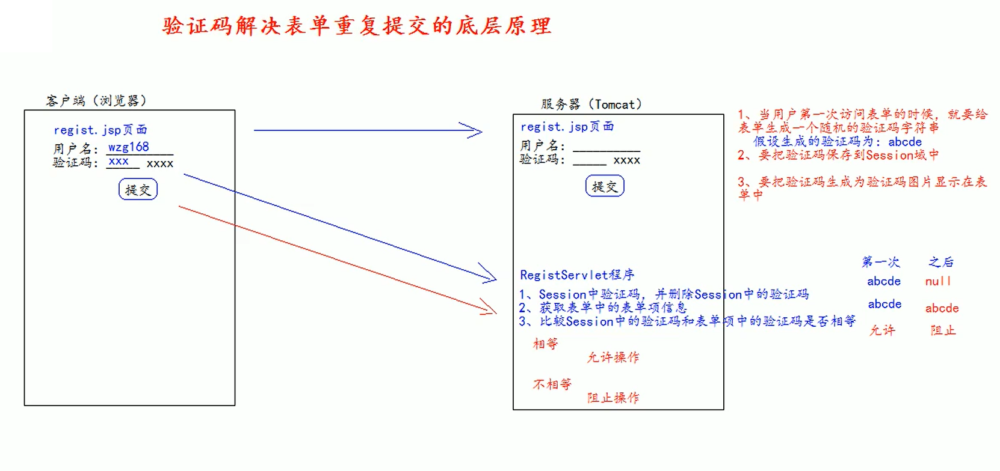
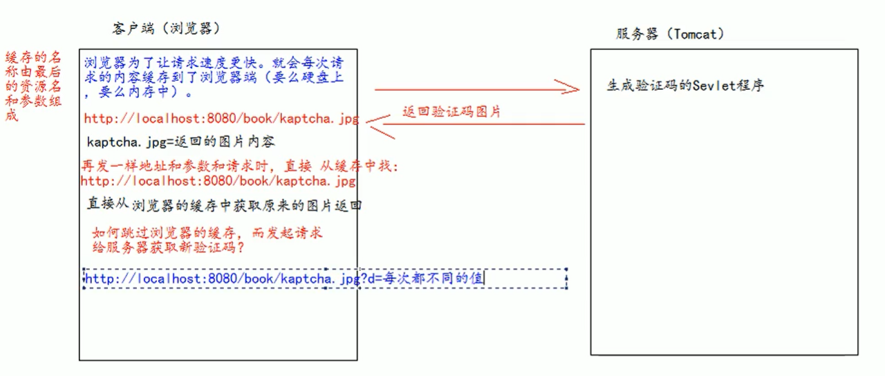
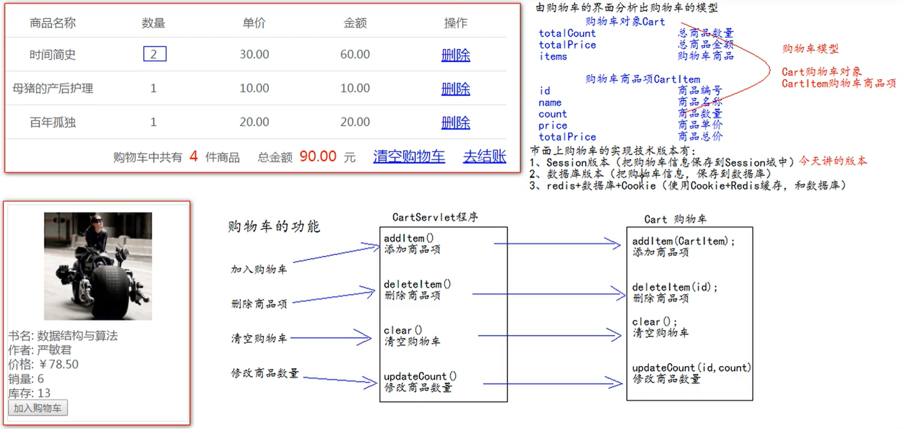

# 项目优化

## 利用映射和隐藏域来调用对应方法

表单中添加隐藏域指定要调用的方法

```jsp
<form action="userServlet" method="POST">
    <input type="hidden" name="action" value="login">
    <label>用户名称：</label>
    <input class="itxt" type="text" placeholder="请输入用户名" autocomplete="off" tabindex="1"
        name="username" value="<%= request.getAttribute("username") == null ? "": request.getAttribute("username") %>" />
    <br />
    <br />
    <label>用户密码：</label>
    <input class="itxt" type="password" placeholder="请输入密码" autocomplete="off" tabindex="1"
        name="password" />
    <br />
    <br />
    <input type="submit" value="登录" id="sub_btn" />
</form>
```

利用映射调用隐藏域参数用对应的方法，将公共部分提取出来作为父类

```java
public abstract class BaseServlet extends HttpServlet{

    private static final long serialVersionUID = -4591155736070821970L;

    @Override
    protected void doPost(HttpServletRequest req, HttpServletResponse resp) throws ServletException, IOException {
        try {
            Method method = this.getClass().getDeclaredMethod(req.getParameter("action"), HttpServletRequest.class, HttpServletResponse.class);
            method.invoke(this, req, resp);
        } catch (Exception e) {
            e.printStackTrace();
        }
    }
}
```

子类中负责具体的业务实现

```java
public class UserServlet extends BaseServlet {

    private static final long serialVersionUID = 2832896465540493468L;

    protected void login(HttpServletRequest req, HttpServletResponse resp) throws ServletException, IOException {
        // ...
    }

    protected void register(HttpServletRequest req, HttpServletResponse resp) throws ServletException, IOException {
        // ...
    }
}
```

## BeanUtils

BeanUtils 工具类可以一次性将请求的参数注入到 JavaBean 中。

将 BeanUtils 进一步封装为如下代码

```java
public class WebUtils {
    public static <T> T copyParamToBean(T bean, Map<String, String[]> map) {
        try {
            BeanUtils.populate(bean, map);
        } catch (Exception e) {
            e.printStackTrace();
        }
        return bean;
    }
}
```

## 前后台

前台：前台是给普通用户使用，一般不需要权限检查，就可以访问的资源。比如淘宝不登录就可以访问的首页。前台地址：`client/bookServlet`

后台：后台是给管理员使用的，一般需要权限检查后才可以访问到的资源或者页面。后台的地址：`/manager/bookServlet`

## 表单重复提交

表单重复提交的三种常见情况：

1. 提交完表单，服务器使用请求转发来进行页面跳转。这时，如果用户刷新页面，就会重新发起最后一期请求，造成表单的重复提交。

当用户提交完请求，浏览器会记录下最后一次请求的全部信息。当用户按下功能键`F5`，就会发起浏览器记录的最后一次请求。

解决方法：使用重定向来进行跳转

```java
protected void insert(HttpServletRequest req, HttpServletResponse resp) throws ServletException, IOException {
    Book book = WebUtils.copyParamToBean(new Book(), req.getParameterMap());
    bookService.insertBook(book);
    req.getRequestDispatcher("/manager/bookServlet?action=query").forward(req, resp);
}
```

这条Servlet语句是将请求中的参数注入到`book`对象中，并将book写入到数据库后，通过请求转发转至`/manager/bookServlet?action=query`。因为请求转发是一次请求，所以如果执行刷新动作，又会向数据添加一个对象。


```java
protected void insert(HttpServletRequest req, HttpServletResponse resp) throws ServletException, IOException {
    Book book = WebUtils.copyParamToBean(new Book(), req.getParameterMap());
    bookService.insertBook(book);
    resp.sendRedirect(req.getContextPath() + "/manager/bookServlet?action=query");
}
```

可以通过将请求转发变为重定向，因为重定向是两次请求，第一次请求会把book对象放入数据库中，返回第二次请求的地址；第二次则是访问第一次响应返回的地址，所以不会存在上述问题。


2. 用户正常提交服务器，但是由于网络延迟等原因，迟迟未收到服务器的响应，这个时候，用户认为提交失败，多点了几次提交操作，也会造成表单重复提交。

3. 用户正常提交服务器，服务器也没有延迟，但是提交完成后，用户回退浏览器重复提交，也会造成表单重复提交。

解决办法：

## kaptcha 验证码的使用

1. 在`pom.xml`中添加 kaptcha Maven 依赖

```xml
<dependency>
    <groupId>com.github.penggle</groupId>
    <artifactId>kaptcha</artifactId>
    <version>2.3.2</version>
</dependency>
```

2. 在 `web.xml` 中配置用于生成验证码的Servlet程序。

```xml
<servlet>
    <servlet-name>kaptchaServlet</servlet-name>
    <servlet-class>com.google.code.kaptcha.servlet.KaptchaServlet</servlet-class>
</servlet>
<servlet-mapping>
    <servlet-name>kaptchaServlet</servlet-name>
    <url-pattern>/kaptcha.jpg</url-pattern>
</servlet-mapping>
```

3. 在 JSP 或者 HTML 页面中使用 `` 标签去显示验证码。

```html

```

4. 服务器从会话中获取生成的验证码，并删除会话中的验证码，并将此与表单中的验证码作比较

```java
protected void register(HttpServletRequest req, HttpServletResponse resp) throws ServletException, IOException {
    String token = (String) req.getSession().getAttribute(Constants.KAPTCHA_SESSION_KEY);
    req.getSession().removeAttribute(Constants.KAPTCHA_SESSION_KEY);
    String code = req.getParameter("code");
    if (token != null && !token.equalsIgnoreCase(code)) {

    }
}
```

## 验证码的切换

因为缓存的原因，相同资源名和参数的资源只会请求一次并将其保存在浏览器中。因此可以通过增加时间戳参数来实现验证码的切换。

```javascript
$(function () {
    $("#code_img").click(function () {
        this.src = "${ basePath }kaptcha.jpg?date=" + new Date().getTime();
    });
}
```



## 购物车

常见的购物车实现技术有：

1. Session版本：把购物车信息缓存到Session域中 （当前实现版本）
2. 数据库版本：把购物车信息保存到数据库
3. Redis + 数据库 + Cookie：使用Cookie + Redis缓存和数据库

因为购物车是放在会话中的，会话属于网络层，所以不需要服务层和数据访问层。



## Referer

在HTTP协议中有一个请求头`Referer`，它可以把浏览器地址栏中的地址发送给服务器。

如果有跳回前一个地址的场景可以使用请求头`Referer`。

## Element 元素的使用

用 jQuery 用多了，有的时候直接使用Element JavaScript 原生的API也是很好用的。

比如
```jsp
<input type="text" class="updateCount" value="${ entry.value.count }" bookId="${ entry.value.id }">
```

```javascript
$(function () {
    $(".updateCount").change(function () {
        // Element 可以通过 getAttribute 获取自定义属性
        var id = this.getAttribute("bookId");
        // 因为 <intput> 是 HTMLInputElement，可以通过 value 属性访问表单值
        // https://developer.mozilla.org/en-US/docs/Web/API/HTMLInputElement
        var count =  this.value;
        if (confirm("是否修改 "+ $(this).parent().parent().find("td").first().text() + "数量为 " + count + " ?")) {
            location.href = "${ pageScope.contextPath }cartServlet?action=updateCount&id=" + id + "&count=" + count;
        } else {
            // defaultValue 也是 HTMLInputElement 的属性之一，该默认值最初是在创建该对象的HTML中指定的
            this.value = this.defaultValue;
        }
    })
})
```

在jQuery 中，事件的回调函数的`this`是绑定事件并触发事件的元素。也就是 `<input>` 元素，该元素是[HTMLInputElement](https://developer.mozilla.org/en-US/docs/Web/API/HTMLInputElement)。

HTMLInputElement 元素可以通过 `value` 属性访问 `<input>` 元素的值

HTMLInputElement 元素可以使用 Element 元素的接口，通过 `getAttribute` 函数可以访问元素的自定义属性。

## 使用 Filter 和 ThreadLocal 管理事务

### ThreadLOcal 介绍

ThreadLocal 可以解决多线程的数据安全问题。

ThreadLocal 可以给当前线程关联一个数据（可以是普通变量，可以是对象，也可以是数组，集合）

ThreadLocal 的特点：

1. ThreadLocal 可以为当前线程国联一个数据（它可以像Map一样存取数据，key为当前线程）。
2. 每个ThreadLocal对象，只能为当前线程关联一个数据；如果要为当前线程关联多个数据，就需要使用多个ThreadLocal对象实例。
3. 每个ThreadLocal对象定义的时候，一般都是`private static`类型
4. ThreadLocal中保存的数据，在线程销毁后会由JVM虚拟机自动释放

```java
public class ThreadLocalDemo {
    private static ThreadLocal<Integer> threadLocal = new ThreadLocal<>() {
        protected Integer initialValue() {
            return -1;
        }
    };

    public static void main(String[] args) throws InterruptedException {
        System.out.println(Thread.currentThread().getName() + "初始值" + threadLocal.get()); // -1
        threadLocal.set(7);
        System.out.println(Thread.currentThread().getName() + "修改后" + threadLocal.get()); // 7

        new Thread(() -> {
            System.out.println(Thread.currentThread().getName() + "初始值" + threadLocal.get()); // -1
            threadLocal.set(30);
            System.out.println(Thread.currentThread().getName()+"修改后"+threadLocal.get());
        }, "A").start(); // 30
        new Thread(() -> {
            System.out.println(Thread.currentThread().getName() + "初始值" + threadLocal.get()); // -1
            threadLocal.set(5);
            System.out.println(Thread.currentThread().getName()+"修改后"+threadLocal.get());
        }, "B").start(); // 5
    }
}

```

上述程序中我们创建了一个存储 Integer 对象类的 ThreadLocal 对象。

- 通过重写`initialValue`方法为线程局部变量设定初始值
- 在线程中调用`threadLocal.get()`可以获取当前线程的局部变量
- 在线程中调用`threadLocal.set(Integer value)` 方法可以设置当前线程的局部变量
- 如果线程局部变量未调用`threadLocal.set(Integer value)`方法修改当前线程的局部变量，`threadLocal.get()`方法返回的是`initialValue`方法设置的默认值

### 事务管理

业务的操作是不具有原子性的，创建订单业务会包含类似订单创建，订单项创建，库存修改和销量修改等多个数据库操作。业务中的任何一个异常倒有可能导致后续的数据操作无法执行，因此为了保证业务对数据库操作的一致性（同时成功，同时失败），就要需要引入类似数据库事务的机制。

**回顾JDBC的数据库事务**

```java
Connection conn = JdbcUtils.getConnection();
try {
    conn.setAutoCommit(false); // 关闭事务自动提交

    // ...

    conn.commit(); // 手动提交事务
} catch (SQLException e) {
    try {
        conn.rollback(); // 手动回滚事务
    } catch (SQLException e1) {
        e1.printStackTrace();
    }
} finally {
    JdbcUtils.close(conn);
}
```

要确保数据库操作的一致性（要么全部成功，要么全部失败）就必须要使用数据的事务。

要确保所有的操作都在一个事务内，就必须要确保所有的操作都是用**同一个Connection连接对象**。

出现异常的时候手动回滚事务，未出现异常的时候手动提交事务。

**JdbcUtils 使用 ThreadLocal 存储线程的 Connection 局部变量**

Tomcat 服务器会为每一个服务器请求创建一个新的线程，在线程中运行相应的Servlet程序。请求的所有的数据操作都是由Servlet程序调用执行的，所以**所有的数据库操作都是在同一个线程中的**。

为了能过够在同一个Servlet程序的任何地方都能获取同一个数据库连接对象，可以使用`ThreadLocal`来将该 `数据库Connection` 作为线程的局部变量。

将`JdbcUtils` 修改如下，通过ThreadLocal来获取线程的中处理事务的`Connection`。

```java
public class JdbcUtils {

    private static DruidDataSource dataSource;
    private static ThreadLocal<Connection> threadLocal = new ThreadLocal<>();

    static {
        try {
            Properties properties = new Properties();
            // 由 .classpath 文件可知，src 目录是 src/main/java，所以 druid.properties 应该放在该目录下
            properties.load(JdbcUtils.class.getClassLoader().getResourceAsStream("druid.properties"));
            dataSource = (DruidDataSource) DruidDataSourceFactory.createDataSource(properties);
        } catch (Exception e) {
            e.printStackTrace();
        }
    }

    public static Connection getConnection() {
        Connection conn = threadLocal.get();
        if (conn == null) {
            try {
                conn = dataSource.getConnection(); // 从数据库连接池中获取连接
                conn.setAutoCommit(false);
            } catch (SQLException e) {
                e.printStackTrace();
            }
            threadLocal.set(conn);
        }
        return conn;
    }

    public static void commitAndClose() {
        Connection conn = threadLocal.get();
        if (conn != null) {
            try {
                conn.commit();
            } catch (SQLException e) {
                e.printStackTrace();
            } finally {
                try {
                    conn.close();
                } catch (SQLException e) {
                    e.printStackTrace();
                }
            }
            threadLocal.remove();
        }
    }

    public static void rollbackAndClose() {
        Connection conn = threadLocal.get();
        if (conn != null) {
            try {
                conn.rollback();
            } catch (SQLException e) {
                e.printStackTrace();
            } finally {
                try {
                    conn.close();
                } catch (SQLException e) {
                    e.printStackTrace();
                }
            }
            threadLocal.remove();
        }
    }
}
```

[ThreadLocal不调用remove方法会导致业务逻辑错误](https://blog.csdn.net/luzhensmart/article/details/86765689)

需要注意的是 Tomcat Web应用底层时使用线程池实现的，该线程会被其他请求继续使用，如果不将线程中的连接对象删除会引发不可预知的错误，所以要调用 `threadLocal.remove()` 将Connection局部变量删除。

**使用Filter为所有Servlet添加 try-catch 实现手动提交和回滚**

在完成JdbcUtils的ThreadLocal实现能获取同一个连接对象之后，下一步就是在业务出现异常的时候对十五手动回滚，正常执行时手动提交。

比较麻烦的做法是将所有的 数据库操作放入 try-catch 语句块中，如果出现异常调用 `JdbcUtils.rollbackAndClose()`； 如果未出现异常则调用`JdbcUtils.commitAndClose()`。这样做无疑是非常繁琐且不利于维护的。

---

Servlet 会接受服务器请求并将请求业务交由Service层处理，Service层通过调用Dao层进行数据操作；一个请求业务的处理往往会包含不止一个数据库操作，所以Service层往往会存在多个Dao层的调用。

可以利用Filter过滤器对所有服务器请求进行事务的提交和回滚。


```java
public class TransactionFilter implements Filter {

    @Override
    public void doFilter(ServletRequest request, ServletResponse response, FilterChain chain)
            throws IOException, ServletException {
        try {
            chain.doFilter(request, response);
            JdbcUtils.commitAndClose();
        } catch (Exception e) {
            e.printStackTrace();
            JdbcUtils.rollbackAndClose();
        }
    }
}
```

```xml
<filter>
    <filter-name>transactionFilter</filter-name>
    <filter-class>xyz.zerxoi.filter.TransactionFilter</filter-class>
</filter>
<filter-mapping>
    <filter-name>transactionFilter</filter-name>
    <url-pattern>/*</url-pattern>
</filter-mapping>
```

需要注意的是Filter过滤器只有在发生异常时将异常上抛至Filer过滤器的时候才会回滚，否则Filter中不会catch到异常也就不会事务回滚。

**Tomcat展示错误页面**

[Tomcat 的 ErrorPage 实现原理分析](https://developer.aliyun.com/article/269353)

将所有异常都统一交给Tomcat，让Tomcat友好的错误信息页面。

将 Filter 捕获到的异常继续向上抛至Tomcat服务器，Tomcat服务器会根据 web.xml 配置的 `<error-page>` 元素展示响应的错误页面。

```java
public class TransactionFilter implements Filter {

    @Override
    public void doFilter(ServletRequest request, ServletResponse response, FilterChain chain)
            throws IOException, ServletException {
        try {
            chain.doFilter(request, response);
            JdbcUtils.commitAndClose();
        } catch (Exception e) {
            e.printStackTrace();
            JdbcUtils.rollbackAndClose();
            throw new RuntimeException(e);
        }
    }
}
```

```xml
<error-page>
    <error-code>404</error-code>
    <location>/pages/error/404.jsp</location>
</error-page>
<error-page>
    <error-code>500</error-code>
    <location>/pages/error/500.jsp</location>
</error-page>
```

```jsp
<%@ page contentType="text/html; charset=UTF-8" isELIgnored="false" %>
<!DOCTYPE html>
<html lang="en">
<head>
    <meta charset="UTF-8">
    <title>404</title>
</head>
<body>
    找不到对象<br>
    <a href="index.jsp">返回首页</a>
</body>
</html>
```

```jsp
<%@ page contentType="text/html; charset=UTF-8" isELIgnored="false" %>
<!DOCTYPE html>
<html lang="en">
<head>
    <meta charset="UTF-8">
    <title>500</title>
</head>
<body>
    服务器内部错误<br>
    <a href="index.jsp">返回首页</a>
</body>
</html>
```