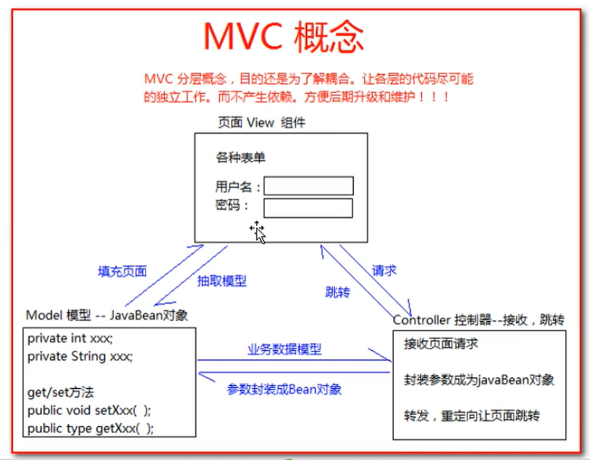
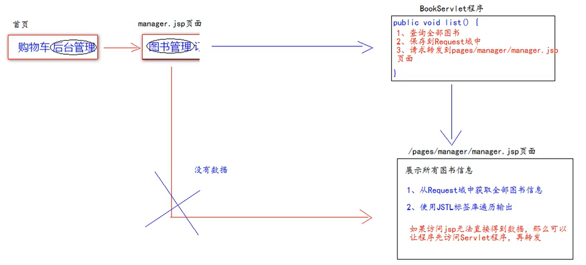

# MVC

参考：[MVC 与三层架构](https://juejin.cn/post/6844903479568252935)

MVC全程：Model模型，View视图，Controller控制器。

MVC最早出现在JavaEE三层中的Web层，它可以有效的指导Web层的代码如何有效分离，单独工作。

View视图：只负责数据和界面的显示，不接受任何与现实数据无关的代码，便于程序员和美工的分工合作——JSP/HTML。

Controller控制器：只负责接收请求，调用业务层的代码处理请求，然后派发页面，是一个调度者的角色——Servlet。转到某个页面或者重定向某个页面。

Model模型：将与业务逻辑相关的数据封装为具体的JavaBean类，其中不会掺杂任何与数据处理相关的代码——JavaBean/domain/entity/pojo。

**MVC是一种思想**

MVC的理念是将软件代码拆分为组件，单独开发，组合使用（目的还是为了降低耦合度）

直接访问JSP页面增加了会将页面展示和业务逻辑耦合在一起，因为图书数据要通过Service层获取，直接访问JSP页面的话就需要在JSP中添加关于Service层的脚本，无疑是增加了耦合度。

将JSP和Servlet分离是遵从了MVC的思想，Servlet负责将处理请求数据，将数据保存在云对象中，之后再请求转发至对应的JSP页面，大大降低了业务逻辑和页面展示的耦合度。
