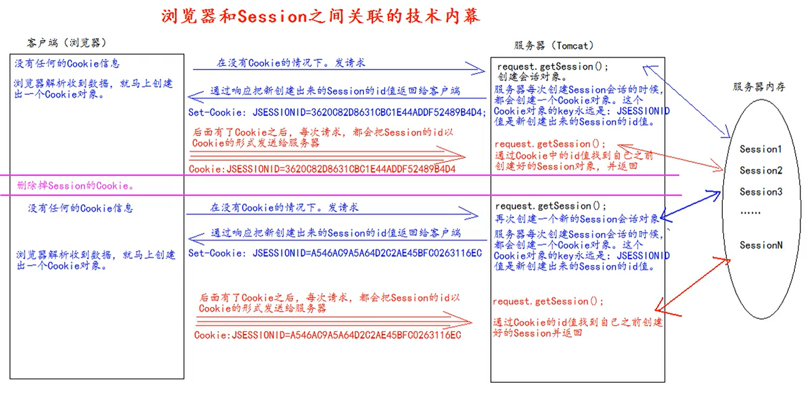

# Session

## 概念

Session会话是基于Cookie技术的，存储在服务器的键值对域对象。

Session是一个接口（HTTPSession）。

Session用来维护一个客户端和服务器之间关联的技术。每个客户端都有自己的一个Session会话。

Session会话中，我们经常用来保存用户登录之后的信息。

## Session的创建和获取（id号，是否为新）

`request.getSession` 来创建和获取 Session 对象。

`request.getSession`通过Cookie的中`JSESSIONID`键值对来查找是否有对应的会话，如果没有`JSESSIONID`键值对或者键值对对应的会话已经超时，则会新创建一个会话。

`session.getId` 来获取 Session会话对应的`JSESSIONID`

`session.isNew` 如果Cookie中没有`JSESSIONID`键值对或者`JSESSIONID`对应的Session会话超时，则会新创建一个会话，`isNew`方法返回`true`。

## Session 域数据的存取

- `session.setAttribute(String name, Object value)`：向Session域中存储数据
- `session.setAttribute(String name)`：获取Session狱中存储的数据


## Session生命周期

Session的超时时两次请求的最大时间间隔。如果在该最大时间间隔内再次请求，则会重置该超时时间；如果请求超过最大时间间隔，Session超时失效。

`session.setMaxInactiveInterval(int interval)` 方法来设置 session 的超时时间（以秒为单位），超过指定的市场，Session就会被销毁。

- `interval`参数大于零，该值表示超时时间
- `interval`参数小于等于零表示永不超时

`session.invalidate()` 方法使`session`立即失效。

`session.getMaxInactiveInterval()` 方法获取超时的时间。

注：在 Tomcat 配置中，`CATALINA_BASE/conf/web.xml`中有设置默认的Session超时时间为30分钟。

```xml
<session-config>
    <session-timeout>30</session-timeout>
</session-config>
```

如果想修改工程的默认Session超时时长，可以直接在工程的 `web.xml` 中添加上述元素修改默认超时时间。

## 浏览器和Session之间关联的技术内幕

Session技术，底层技术其实是基于Cookie技术来实现的。



这也解释了为什么？

Session明明没有超时，但是浏览器关闭之后就超时了，因为会话创建的Cookie的存活时间是Session。该Cookie会在浏览器关闭之后删除，所以下次发送请求时不会加上该Cookie，`req.getSession()` 方法就只能创建一个新的Session。