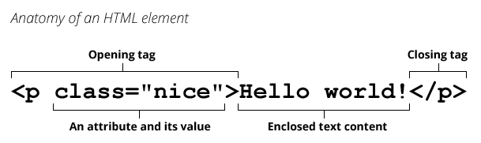

# HTML

**HTML (HyperText Markup Language)** 不是一门编程语言，而是一种用来告知浏览器如何组织页面的标记语言。HTML 可复杂、可简单，一切取决于开发者。它由一系列的**元素（elements）**组成，这些元素可以用来包围不同部分的内容，使其以某种方式呈现或者工作。

[HTML 参考](https://developer.mozilla.org/en-US/docs/Web/HTML/Reference)

## [HTML术语表 概念和语法](https://developer.mozilla.org/zh-CN/docs/Glossary/HTML)

## [开始学习HTML](https://developer.mozilla.org/zh-CN/docs/Learn/HTML/Introduction_to_HTML/Getting_started)

注：HTML 标签不区分大小写。

### 元素

**元素**是网页的一部分，在 XML 和 HTML 中，一个元素可以包含一个数据项，或是一块文本，或是一张照片，亦或是什么也不包含。 一个典型的**元素**包括一个具有一些**属性**的**开始标签**，中间的**文本内容**和一个**结束标签**。

[元素(Element)](https://developer.mozilla.org/zh-CN/docs/Glossary/%E5%85%83%E7%B4%A0)
[标签(Tag)](https://developer.mozilla.org/zh-CN/docs/Glossary/Tag)
[属性(Attribute)](https://developer.mozilla.org/zh-CN/docs/Glossary/Attribute)



元素可以嵌套

**元素的分类**:

按标签

- 双标签元素: 元素拥有开始标签，内容，结束标签
- 单标签(空元素): 元素只有一个标签，通常用来在此元素所在位置插入/嵌入一些东西。

按展现形式

- [块级元素](https://developer.mozilla.org/en-US/docs/Web/HTML/Block-level_elements)
- [内联元素](https://developer.mozilla.org/en-US/docs/Web/HTML/Inline_elements)

HTML5元素分类

[元素内容分类](https://developer.mozilla.org/zh-CN/docs/Web/Guide/HTML/Content_categories)

### 属性

### HTML 文档

```html
<!DOCTYPE html>
<html>
  <head>
    <meta charset="utf-8">
    <title>我的测试站点</title>
  </head>
  <body>
    <p>这是我的页面</p>
  </body>
</html>
```

1. `<!DOCTYPE html>`: 声明文档类型。文档类型声明类似于链接，规定了HTML页面必须遵从的良好规则，能自动检测错误和其他有用的东西。`<!DOCTYPE html>`是最短有效的文档声明。
2. `<html></html>`: `<html>`元素。这个元素包裹了整个完整的页面，是一个根元素。
3. `<head></head>`: `<head>`元素. 这个元素是一个容器，它包含了所有你想包含在HTML页面中但不想在HTML页面中显示的内容。这些内容包括你想在搜索结果中出现的关键字和页面描述，CSS样式，字符集声明等等。
4. `<meta charset="utf-8">`: 这个元素设置文档使用utf-8字符集编码，utf-8字符集包含了人类大部分的文字。
5. `<title></title>`: 设置页面标题，出现在浏览器标签上。
6. `<body></body>`: `<body>`元素。 包含了你访问页面时所有显示在页面上的内容，文本，图片，音频，游戏等等。

### 实体引用(转义字符)

|原义字符|等价字符引用|
|-------|-----------|
|`<`|`&lt;`|
|`>`|`&gt;`|
|`"`|`&quot;`|
|`'`|`&apos;`|
|`&`|`&amp;`|

[XML和HTML字符实体引用列表](https://en.wikipedia.org/wiki/List_of_XML_and_HTML_character_entity_references)

### 注释

```html
<!-- 注释 -->
```

## 常用元素

### 图片

[``: The Image Embed element](https://developer.mozilla.org/en-US/docs/Web/HTML/Element/img)

`src`属性:

  - 相对路径: 相对于HTML文件所在目录
    - `.`: 当前目录
    - `..`: 上一级目录
  - 句对路径: 图片URL

### 表格

[`<table>`: The Table element](https://developer.mozilla.org/en-US/docs/Web/HTML/Element/table)

- `colgroup`: 定义表中的一组列
- `tr`元素: 表格行标签
- `th`元素: 表格标题标签
- `td`元素: 表格数据
  - `colspan`属性: 跨列
  - `colrow`属性: 跨行

### 列表

[`<ul>`: The Unordered List element](https://developer.mozilla.org/en-US/docs/Web/HTML/Element/ul)

[`<ol>`: The Ordered List element](https://developer.mozilla.org/en-US/docs/Web/HTML/Element/ol)

### 内联框架元素

[`<iframe>`: The Inline Frame element](https://developer.mozilla.org/en-US/docs/Web/HTML/Element/iframe)

- `name`:嵌入式浏览上下文的可定位名称。可以在`<a>`，`<form>`或`<base>`元素的`target`属性中使用。 `<input>`或`<button>`元素的`formtarget`属性；或`window.open()`方法中的windowName参数。

```html
<iframe src="index.html" name="iframe"></iframe>
<ul>
    <li><a href="login.html" target="iframe">Login</a></li>
    <li><a href="register.html" target="iframe">Register</a></li>
</ul>
```

### 表单

表单: [`<form>`](https://developer.mozilla.org/en-US/docs/Web/HTML/Element/form)

- `action`: 处理表单提交的URL。此值可以由`<button>`，`<input type="submit">`或`<input type="image">`元素上的`formaction`属性覆盖。
- `method`: 提交表单的HTTP方法。该值被`<button>`，`<input type ="submit">`或`<input type="image">`元素上的`formmethod`属性覆盖。

标签: [`<label>`](https://developer.mozilla.org/en-US/docs/Web/HTML/Element/label)

将一个 `<label>` 和一个 [**labelable元素**](https://developer.mozilla.org/en-US/docs/Web/Guide/HTML/Content_categories#Form_labelable) 相关联.

- 给 `<input>` 一个 `id` 属性。而 `<label>` 需要一个 `for` 属性，其值和  `<input>` 的 `id` 一样
- 将 `<input>` 直接放在 `<label>` 里，此时则不需要 `for` 和 `id` 属性，因为关联已隐含存在

[`<input>`: The Input (Form Input) element](https://developer.mozilla.org/en-US/docs/Web/HTML/Element/input)

- `name`属性: 表单控件的的名称. 和表单一起提交, 作为名称/值对的一部分.
- `value`属性: 表单控件的当前值. 和表单一起提交, 作为名称/值对的一部分.

单选框: [`<input type="radio">`](https://developer.mozilla.org/en-US/docs/Web/HTML/Element/input/radio)

单选类型元素在单选组中使用. 通过为单选元素类型指定相同的`name`属性, 将多个单选类型放入同一单选组.

同一组中只能同时选择一个单选按钮. 单选按钮通常呈现为小圆圈, 选中时将其填充或突出显示.

多选框: [`<input type="checkbox">`](https://developer.mozilla.org/en-US/docs/Web/HTML/Element/input/checkbox)

下拉框: [`<select>`: The HTML Select element](https://developer.mozilla.org/en-US/docs/Web/HTML/Element/select)

隐藏框: [`<input type="hidden">`](https://developer.mozilla.org/en-US/docs/Web/HTML/Element/input/hidden)

"hidden" 类型的 `<input>` 元素允许 Web 开发者存放一些用户不可见、不可改的数据，在用户提交表单时，这些数据会一并发送出。比如，正被请求或编辑的内容的 ID，或是一个唯一的安全令牌。这些隐藏的 `<input>` 元素在渲染完成的页面中完全不可见，而且没有方法可以使它重新变为可见。

提交按钮: [`<input type="submit">`](https://developer.mozilla.org/en-US/docs/Web/HTML/Element/input/submit)

```html
<form action="http://localhost:8080" method="GET">
    <input type="hidden" name="action" value="login">
    <div>
        <label>用户名称<input type="text" name="username"></label>
    </div>
    <div>
        <label>用户密码<input type="password" name="password"></label>
    </div>
    <div>
        <label>确认密码<input type="password" name="confirm"></label>
    </div>
    <div>
        <span>性别</span>
        <label><input type="radio" name="sex" value="0">男</label>
        <label><input type="radio" name="sex" value="1">女</label>
    </div>
    <div>
        <span>兴趣</span>
        <label><input type="checkbox" name="interests" value="0">编程</label>
        <label><input type="checkbox" name="interests" value="1">音乐</label>
        <label><input type="checkbox" name="interests" value="2">运动</label>
    </div>

    <div>
        <label>国籍
            <select name="country">
                <option value="">----请选择国籍----</option>
                <option value="chinese">中国</option>
                <option value="america">美国</option>
                <option value="japan">日本</option>
            </select>
        </label>
    </div>
    <div>
        <label>自我介绍
            <textarea name="introduction" cols="30" rows="10"></textarea>
        </label>
    </div>
    <div>
        <input type="reset">
        <input type="submit">
    </div>
</form>
```

### 其他标签

`<p>`和`<div>`都是块级元素, 区别是`<p>`元素上下有`margin`即外边距, 就像是空了一行一样; 而`<div>`则没有.
