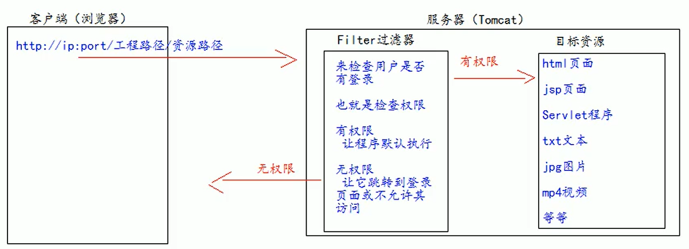
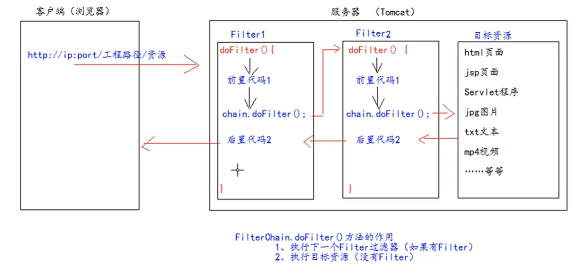

# Filter 过滤器

## 概念

Filter 过滤器是JavaWeb的三大组件之一（Servlet程序，Listener监听器，Filter过滤器）。

Filter过滤器是JavaEE的规范，也就是接口。

Filter过滤器的作用是：**拦截请求**，过滤响应。

拦截请求常见的应用场景：

1. 权限检查
2. 日记操作
3. 事务管理



## 初体验

要求在你的 web 工程下，有一个 `admin` 目录，该目录下的所有资源（HTML页面，jpg页面，jsp文件等等）都必须是用户登陆之后才允许访问。

思考：根据之前学过的内容可知，用户登录之后会把用户登录的信息保存到Session域中，所以要检查用户是否登录，可以判断Session中是否包含用户登录的信息即可。

1. 编写一个类去实现 Filter 接口，实现过滤方法 `doFilter`。

```java
public class AdminFilter implements Filter {

    @Override
    public void doFilter(ServletRequest request, ServletResponse response, FilterChain chain)
            throws IOException, ServletException {
        HttpServletRequest req = (HttpServletRequest) request;
        Object user = req.getSession().getAttribute("user");
        if (user == null) {
            // 请求拦截
            req.getRequestDispatcher("/login.jsp").forward(request, response);
        } else {
            // 请求放行
            chain.doFilter(request, response);
        }

    }
    
}
```

2. 配置Filter过滤器拦截资源的路径和实现类

```xml
<filter>
    <filter-name>adminFilter</filter-name>
    <filter-class>xyz.zerxoi.filter.AdminFilter</filter-class>
</filter>
<filter-mapping>
    <filter-name>adminFilter</filter-name>
    <url-pattern>/admin/*</url-pattern>
</filter-mapping>
```

`<url-pattern>` 元素表示访问工程目录下的 `/admin/*` 资源时会使用Filter过滤器进行过滤。

## Filter 生命周期

Filter 的生命周期包含几个方法：

1. 构造器方法
2. `init` 初始化方法
3. `doFilter` 过滤方法
4. `destroy` 销毁方法

- 这些方法都是由 Tomcat 中的Web 容器调用的。
- 构造器方法（Filter创建）和 `init` 初始化方法在Web工程启动时调用且只执行一次
- `doFilter` 会在每次访问 `web.xml` 配置的 `<url-pattern>` 时调用，可调用多次
- `destroy` 会在停止Web 工程时调用，销毁Filter过滤器

## FilterConifg 类

`FilterConfig` 类见名知义，它是`Filter`过滤器的配置类

Tomcat每次创建`Filter`的时候也会同时创建一个`FilterConfig`类，这里包含了`Filter`配置文件的配置信息。

FilterConfig 类的作用是获取Filter过滤器的配置内容

1. 获取 `Filter` 的名称 `<filter-name>` 的内容：`filterConfig.getFilterName()`
2. 获取在 `Filter` 中配置的 `<init-param>` 初始化参数：`filterConfig.getInitParameter(name)`
3. 获取 `ServletContext` 对象：`filterConfig.getServletContext()`

```xml
<filter>
    <filter-name>adminFilter</filter-name>
    <filter-class>xyz.zerxoi.filter.AdminFilter</filter-class>
    <init-param>
        <param-name>username</param-name>
        <param-value>admin</param-value>
    </init-param>
    <init-param>
        <param-name>password</param-name>
        <param-value>admin</param-value>
    </init-param>
</filter>
```

```java
@Override
public void init(FilterConfig filterConfig) throws ServletException {
    System.out.println(filterConfig.getFilterName()); // adminFilter
    System.out.println(filterConfig.getInitParameter("username")); // admin
    System.out.println(filterConfig.getInitParameter("password")); // admin
    System.out.println(filterConfig.getServletContext()); // org.apache.catalina.core.ApplicationContextFacade@5f291fe
}
```

## FilterChain 过滤器链

FilterChain 控制多个过滤器如何工作。

`filterChain.doFilter(req, resp)`方法的作用：

有过还有Filter过滤器的话，执行下一个 `Filter` 过滤器否则执行目标资源。



### 示例

分别创建 `Filter1` 和 `Filter2`

```java
public class Filter1 implements Filter {
    @Override
    public void doFilter(ServletRequest request, ServletResponse response, FilterChain chain)
            throws IOException, ServletException {
        System.out.println("Filter1 before");
        chain.doFilter(request, response);
        System.out.println("Filter1 after");
    }
}
```

```java
public class Filter2 implements Filter {
    @Override
    public void doFilter(ServletRequest request, ServletResponse response, FilterChain chain)
            throws IOException, ServletException {
        System.out.println("Filter2 before");
        chain.doFilter(request, response);
        System.out.println("Filter2 after");
    }
}
```

`web.xml` 文件配置如下

```xml
<filter>
    <filter-name>filter1</filter-name>
    <filter-class>xyz.zerxoi.filter.Filter1</filter-class>
</filter>
<filter>
    <filter-name>filter2</filter-name>
    <filter-class>xyz.zerxoi.filter.Filter2</filter-class>
</filter>
<filter-mapping>
    <filter-name>filter1</filter-name>
    <url-pattern>/target.jsp</url-pattern>
</filter-mapping>
<filter-mapping>
    <filter-name>filter2</filter-name>
    <url-pattern>/target.jsp</url-pattern>
</filter-mapping>
```

```jsp
<%@ page contentType="text/html; charset=UTF-8" isELIgnored="false" %>

<!DOCTYPE html>
<html lang="en">
<head>
    <meta charset="UTF-8">
    <title>Targer</title>
</head>
<body>
    <%
        System.out.println("target.jsp");
    %>
    target.jsp
</body>
</html>
```

在访问 target.jsp 资源时，命令行输出如下

```
Filter1 before
Filter2 before
target.jsp
Filter2 after
Filter1 after
```

### Filter 的顺序

如果将示例中的 `web.xml` 中的 filter2 的 `<filter-mapping>` 放在 filter1 的 `<filter-mapping>` 的前面。

```xml
<filter>
    <filter-name>filter1</filter-name>
    <filter-class>xyz.zerxoi.filter.Filter1</filter-class>
</filter>
<filter>
    <filter-name>filter2</filter-name>
    <filter-class>xyz.zerxoi.filter.Filter2</filter-class>
</filter>
<filter-mapping>
    <filter-name>filter2</filter-name>
    <url-pattern>/target.jsp</url-pattern>
</filter-mapping>
<filter-mapping>
    <filter-name>filter1</filter-name>
    <url-pattern>/target.jsp</url-pattern>
</filter-mapping>
```

再次访问 `target.jsp`， 命令行输出结果如下

```
Filter2 before
Filter1 before
target.jsp
Filter1 after
Filter2 after
```

但是如果将示例中的 `web.xml` 中的 filter2 的 `<filter>` 元素放在 filter2 的 `<filter>` 元素后面则不会改变顺序。

## 不调用 chain.doFilter 方法的情况

如果将示例中的Filter2 的 Java 代码中的 `chain.doFilter` 删除

```java
public class Filter2 implements Filter {
    @Override
    public void doFilter(ServletRequest request, ServletResponse response, FilterChain chain)
            throws IOException, ServletException {
        System.out.println("Filter2 before");
        // chain.doFilter(request, response);
        System.out.println("Filter2 after");
    }
}
```

访问 `target.jsp` 页面的输出结果如下。

```
Filter1 before
Filter2 before
Filter2 after
Filter1 after
```

可以看出程序并没有进入 `target.jsp` 页面，Filter2 执行完后置代码之后，回到上一个过滤器（Filter1） 中继续执行。

## 多个 Filter 过滤器的执行特点

1. 所有的Filter和目标资源默认都执行在同一个线程中。
2. 多个Filter共同执行的时候，它们都使用同一个 Request 对象

验证

分别将 Filter1 和 Filter2 的 Java 代码修改如下。

```java
public class Filter1 implements Filter {
    @Override
    public void doFilter(ServletRequest request, ServletResponse response, FilterChain chain)
            throws IOException, ServletException {
        System.out.println("Filter1 Thread: " + Thread.currentThread().getName());
        System.out.println("Filter1 Request: " + request);
        chain.doFilter(request, response);
    }
}
```

```java
public class Filter2 implements Filter {
    @Override
    public void doFilter(ServletRequest request, ServletResponse response, FilterChain chain)
            throws IOException, ServletException {
        System.out.println("Filter2 Thread: " + Thread.currentThread().getName());
        System.out.println("Filter2 Request: " + request);
        chain.doFilter(request, response);
    }
}
```

修改 `target.jsp` 执行如下语句

```jsp
<%
    System.out.println("JSP Thread: " + Thread.currentThread().getName());
    System.out.println("JSP Request: " + request);
%>
```

输出结果如下，由结果可知，多个Filter和目标资源使用的都是同一线程和请求对象。

```
Filter1 Thread: http-nio-8080-exec-116
Filter1 Request: org.apache.catalina.connector.RequestFacade@64bc442c
Filter2 Thread: http-nio-8080-exec-116
Filter2 Request: org.apache.catalina.connector.RequestFacade@64bc442c
JSP Thread: http-nio-8080-exec-116
JSP Request: org.apache.catalina.connector.RequestFacade@64bc442c
```

## Filter 拦截路径（`<url-pattern>` 规则）

[12.2 Specification of Mappings](https://javaee.github.io/servlet-spec/downloads/servlet-4.0/servlet-4_0_FINAL.pdf)

- A string beginning with a `/` character and ending with a `/*` suffix is used for **path mapping**.
- A string beginning with a `*.` prefix is used as an **extension mapping**.
- The empty string (`""`) is a special URL pattern that exactly maps to the application's **context root**, i.e., requests of the form `http://host:port/<contextroot>/`. In this case the path info is `/` and the servlet path and context path is empty string (`""`).
- A string containing only the `/` character indicates **the "default" servlet** of the application. In this case the servlet path is the request URI minus the context path and the path info is null.
- All other strings are used for **exact matches** only.

按找匹配的优先级排序如下

1. 精确匹配

```xml
<url-pattern>/target.jsp</url-pattern>
```

因为 `/` 表示默认路径，所以不能用 `/` 表示上下文根路径。空字符串 `""` 会精确匹配上下文根路径。

2. 目录匹配

```xml
<url-pattern>/admin/*</url-pattern>
```

3. 后缀名匹配

```xml
<url-pattern>*.html</url-pattern>
```

后缀名匹配要以`*`开头

4. 默认路径

```xml
<url-pattern>/</url-pattern>
```

在**Servlet 容器中没有匹配的内置 Servlet**或者**没有注册与之匹配的 Servlet**的时候，默尔维尼路径的 Servlet 会被调用。需要注意的是默认路劲 `/` 的 `Servlet` 在访问 JSP 文件的时候不会被调用，因为 Servlet 容器中 url-pattern 为 `*.jsp` 的内置 Servlet 会被调用，其优先级大于默认路径。

`<url-pattern>/*</url-pattern>`会将所有请求都发送到手动注册的 `Servlet` 程序中，但是如果访问 `*.html` 页面并不需要手动注册的 Servlet程序、访问 `*.jsp` 需要使用容器内置的 Servlet 而不是手动注册的 Servlet。所以相对于 `/*`，使用 `/` 是更安全的做法。

---

注：

1. 一个 `<filter-mapping>` 可以有多个 `<url-pattern>` 元素。
2. Filter 过滤器只关心请求的地址是否匹配，不关系请求的资源是否存在。