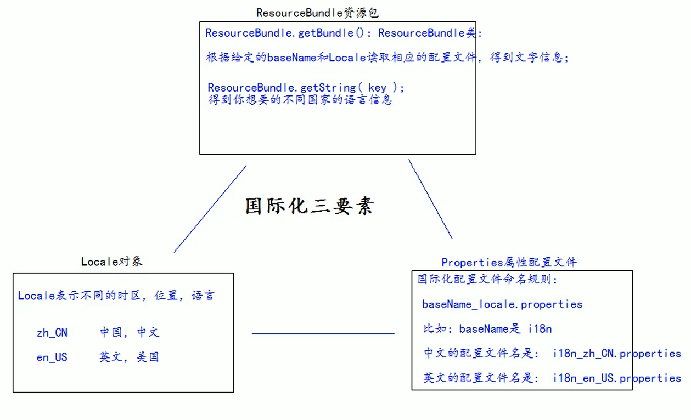

# i18n 国际化

## 概念

- 国际化(internationalization)是指同一个网站可以支持多种不同的语言，以方便不同国家，不同语种的用户访问。
- 关于国际化想到的最简单的方案就是为不同的郭建创建不同的网站。例如苹果公司，它的英文官网是`https://www.apple.com/`，中文官网是`https://www.apple.com.cn/`。
- 苹果公司这种方案并不适合全部公司，而我们希望同一个网站在不同国家访问显示不同的语言文字，而网站的布局样式等不发生改变。
- 国际化的英文Internationalization，首字母`i`和尾字母`n`之间有18个英文字符，所以简称为i18n。

## 国际化要素介绍



### Locale

`Locale` 的获取

```java
Locale.getAvailableLocales(); // 获取全部可用的 Locale
Locale.getDefault(); // 获取系统默认 Locale
new Locale("zh", "CN"); // zh_CN
Locale.CHINA; // zh_CN
Locale.SIMPLIFIED_CHINESE; // zh_CN
Locale.TRADITIONAL_CHINESE; // zh_TW
Locale.US; // en_US
```

### properties

`i18n_en_US.properties`

```properties
username=Username
password=Password
sex=Sex
age=Age
regist=Regist
male=Male
female=Female
email=Email
reset=Reset
submit=Submit
```

`i18n_zh_CN.properties`

```properties
username=用户名
password=密码
sex=性别
age=年龄
regist=注册
male=男
female=女
email=邮箱
reset=重置
submit=提交
```

注：properties 文件可能会在打包的时候被忽略，记得在 `pom.xml` 添加如下内容

```xml
<resources>
    <resource>
    <directory>src/main/java</directory>
    <includes>
        <include>**/*.properties</include>
    </includes>
    </resource>
</resources>
```

### ResourceBundle

[Class ResourceBundle](https://docs.oracle.com/en/java/javase/11/docs/api/java.base/java/util/ResourceBundle.html)

通过 `ResourceBundle.getBundle` 方法可以通过指定的`baseName` 和 `Locale` 参数，在 `Caller Module` 的路径下查找指定`properties`资源；如果指定了`Module`或者`ClassLoader`则会调用`Module.getResourceAsStream(String)`从给定模块中查或调用`ClassLoader.getResourceAsStream(String)`从给定的类中查。

将查找的结果生成 `ResourceBundle` 对象并通过 `resourceBundle.getString` 获取通过键获取相应的值。

**资源包搜索和加载策略**

```
baseName + "_" + language + "_" + script + "_" + country + "_" + variant
baseName + "_" + language + "_" + script + "_" + country
baseName + "_" + language + "_" + script
baseName + "_" + language + "_" + country + "_" + variant
baseName + "_" + language + "_" + country
baseName + "_" + language
```

```java
Locale locale = Locale.US;
ResourceBundle bundle = ResourceBundle.getBundle("i18n", locale);
System.out.println("username: " + bundle.getString("username"));
System.out.println("password: "+bundle.getString("password"));
System.out.println("sex: "+bundle.getString("sex"));
System.out.println("age: "+bundle.getString("age"));
```

### JSTL 格式化标签

[JSP 标准标签库（JSTL）](https://www.runoob.com/jsp/jsp-jstl.html)

[JSTL fmt](https://docs.oracle.com/javaee/5/jstl/1.1/docs/tlddocs/index.html)

```jsp
<%@ page contentType="text/html; charset=UTF-8" isELIgnored="false" %>
<%@ taglib prefix="fmt" uri="http://java.sun.com/jsp/jstl/fmt" %>
<!DOCTYPE html PUBLIC "-//W3C//DTD HTML 4.01 Transitional//EN" "http://www.w3.org/TR/html4/loose.dtd">
<html>
<head>
<title>JSTL fmt</title>
</head>
<body>
	<%--1 使用标签设置Locale信息--%>
	<fmt:setLocale value="${param.locale}" />
	<%--2 使用标签设置baseName--%>
	<fmt:setBundle basename="i18n"/>

	<a href="i18n_fmt.jsp?locale=zh_CN">中文</a>|
	<a href="i18n_fmt.jsp?locale=en_US">English</a>
	<center>
		<h1><fmt:message key="regist" /></h1>
		<table>
		<form>
			<tr>
				<td><fmt:message key="username" /></td>
				<td><input name="username" type="text" /></td>
			</tr>
			<tr>
				<td><fmt:message key="password" /></td>
				<td><input type="password" /></td>
			</tr>
			<tr>
				<td><fmt:message key="sex" /></td>
				<td>
					<input type="radio" /><fmt:message key="male" />
					<input type="radio" /><fmt:message key="female" />
				</td>
			</tr>
			<tr>
				<td><fmt:message key="email" /></td>
				<td><input type="text" /></td>
			</tr>
			<tr>
				<td colspan="2" align="center">
				<input type="reset" value="<fmt:message key="reset" />" />&nbsp;&nbsp;
				<input type="submit" value="<fmt:message key="submit" />" /></td>
			</tr>
			</form>
		</table>
	</center>
</body>
</html>
```